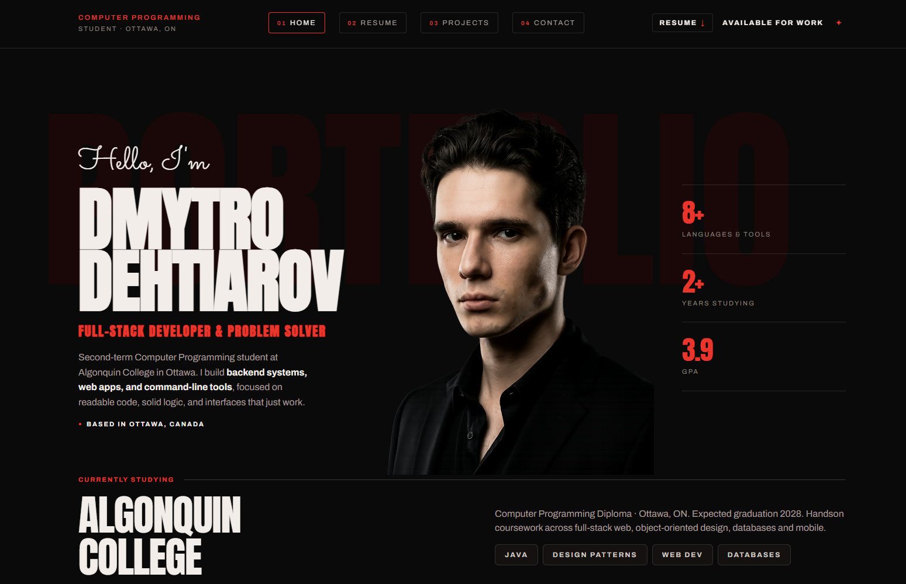

# Dmytro Dehtiarov — Portfolio Website

A responsive personal portfolio built with plain HTML, CSS and JavaScript. Five pages (Home, Resume, Projects, Contact, 404) sharing one stylesheet and one script file, with a shared header/footer synced from a single source of truth (see [Editing the header/footer](#editing-the-headerfooter)).



## Live demo

Once deployed to GitHub Pages, the site will be available at:
`(https://dmytro-dehtiarov.github.io/portfolio/)`

## Features

- Fully responsive layout (desktop / tablet / mobile) with a mobile burger menu
- Projects page with a vanilla-JS slideshow (prev/next, looping, live counter)
- Contact form with live client-side validation and AJAX submission via [Formspree](https://formspree.io) — no backend required
- Downloadable, ATS-friendly PDF resume (`resume.pdf`), linked from the header and footer on every page
- Header/footer are generated from `partials/` by a small build script, so they can't drift out of sync between pages
- Design system driven entirely by CSS custom properties (colors, type scale, spacing)
- Accessible markup: semantic headings, `sr-only` labels, `aria-live` status messages, keyboard-navigable nav

## Tech stack

- HTML5
- CSS3 (custom properties, Grid, Flexbox, `backdrop-filter`, `aspect-ratio`)
- Vanilla JavaScript (ES6+, no dependencies)
- [Formspree](https://formspree.io) for contact form delivery
- Google Fonts: Anton, Archivo, Sacramento

## Project structure

```
.
├── index.html              # Home page
├── resume.html              # Resume / experience page
├── projects.html            # Projects slideshow
├── contact.html              # Contact form + details
├── 404.html                  # Custom 404 page
├── partials/
│   ├── header.html          # Source of truth for <header> — edit here, not in the pages
│   └── footer.html          # Source of truth for <footer> — edit here, not in the pages
├── build.js                  # Syncs partials/ into every page (see below)
├── resume.pdf                 # Downloadable resume, linked from header + footer
├── css/
│   └── styles.css
├── js/
│   └── script.js
├── images/                    # Photos and project screenshots
├── favicon.svg
├── robots.txt
├── LICENSE
└── README.md
```

## Getting started (local)

No build tools needed — it's static HTML/CSS/JS. Either:

- Open `index.html` directly in a browser, or
- Serve it locally so relative paths behave exactly like production:
  ```bash
  # Python
  python3 -m http.server 8000

  # or Node
  npx serve .
  ```
  Then visit `http://localhost:8000`.

## Editing the header/footer

The `<header>` and `<footer>` used to be pasted by hand into every page, which drifted out of sync between pages more than once. Now they're generated from `partials/header.html` and `partials/footer.html` — **edit those two files only**, never the header/footer markup inside `index.html`, `resume.html`, `projects.html`, `contact.html` or `404.html` directly.

After editing a partial, run:

```bash
node build.js
```

This rewrites the `<!-- BUILD:HEADER --> ... <!-- /BUILD:HEADER -->` and `<!-- BUILD:FOOTER --> ... <!-- /BUILD:FOOTER -->` block in every page from the partials (and sets the correct nav `active` state per page). Commit the regenerated page files along with your partial changes. No dependencies or install step — it's plain Node.

The published site is still 100% static HTML; this script only needs to run on your machine before a commit, not at deploy time.

## Setting up the contact form (Formspree)

The form in `contact.html` posts to Formspree so it works with zero backend code. To make it actually deliver mail to you:

1. Create a free account at [formspree.io](https://formspree.io).
2. Create a new form and copy the form ID it gives you (looks like `xayzabcd`).
3. In `contact.html`, find the `<form>` tag:
   ```html
   <form class="contact-form" id="contactForm" action="https://formspree.io/f/YOUR_FORM_ID" method="POST" novalidate>
   ```
4. Replace `YOUR_FORM_ID` with your real ID.
5. Submit a test message — Formspree requires confirming the first submission by clicking a link it emails you.

Until step 4 is done, the form will validate correctly on the client but fail to actually send (Formspree will reject the placeholder ID).

## Deployment (GitHub Pages)

1. Push this repo to GitHub.
2. In the repo, go to **Settings → Pages**.
3. Under **Source**, choose the `main` branch and `/ (root)` folder, then save.
4. GitHub will publish the site at `https://<username>.github.io/<repo-name>/` within a minute or two.
5. Update the live demo link at the top of this README.

No GitHub Actions workflow is required — this is a static site GitHub Pages can serve as-is.

## Notes on content

- The phone number and email in the Resume and Contact pages are real contact details — update them in `resume.html` and `contact.html` if you reuse this template for yourself.
- `images/Header_img.png` was resized/recompressed for web (2.4 MB → ~1.1 MB) with no visible quality loss; the project screenshots were already efficiently compressed and left as-is.
- `resume.pdf` is intentionally plain (light background, single column, no graphics) rather than matching the site's dark theme — this makes it parse correctly in ATS systems and print cleanly. Regenerate it from the source data whenever the resume content changes.

## License

MIT — see [LICENSE](LICENSE).

## Contact

- Email: [degtyarev.dmitry02@gmail.com](mailto:degtyarev.dmitry02@gmail.com)
- GitHub: [github.com/dmytro-dehtiarov](https://github.com/dmytro-dehtiarov)
- LinkedIn: [linkedin.com/in/dmytro-dehtiarov-7aa991253](https://www.linkedin.com/in/dmytro-dehtiarov-7aa991253/)
